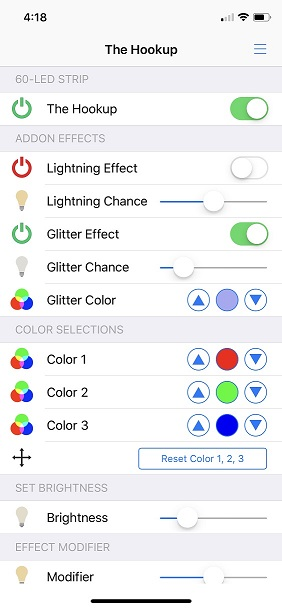
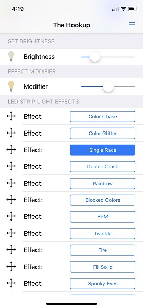

# openhab-MQTTv2-LED-strip

OpenHab MQTT v2 example for LED-strip using ESP8266 and Arduino 

This example uses the Holiday LED 2.0 Arduino sketch developed by TheHookup, which originally comes with support for Home Assistant, and I added support for OpenHab 2.4. 

For the original sketch and H.A. files, I refer to:
https://github.com/thehookup/Holiday_LEDs_2.0

I ported the sketch to NodeMCU (HiLetgo ESP8266 NodeMCU LUA CP2102 ESP-12E) and the Sonoff Basic. Both work just fine. For Sonoff Basic I used pin14 to program the LED strip. This requires some header soldering to enable flashing the Sonoff Basic and to get access to pin14.

I have tested it with a 1 meter 60 LED strip and a 5 meter 150 LED strip. Both the strips are WS2812b based. I tried both a CHINLY 5V, 10A Power Supply and a LETOUR DC 5V 30A Power Supply and each power supply works just fine with each LED strip. The 60 LED strip draws about 15 W at full white and the 150 LED strip about 38 W at full white.

Regarding OpenHab support, I am using the new MQTTv2 binding, with a things, items, sitemap and rules file. The various files are straightforward. I had to add a rules file to convert some the ranges for some of the slider signals of the sketch as the OpenHab slider only supports 0...100 and the original sketch from the hookup uses different ranges for some of the signals. I could have easily done these conversions in the sketch and as such not needing the rules file, but I wanted to be able to use the thehookup sketch "out of the box", such that there remains compiance with future versions.

You will need the following files:
- thehookup.things --> modify the MQTT broker settings to be compliant with your MQTT broker
The following files can be used as is:
- thehoookup.items
- thehookup.sitemap
- thehookup.rules

For the Arduino sketch, please refer to the link above. The sketch works out of the box with my NodeMCU.
In the sketch, you will need to update the MQTT broker setttings, the MQTT topics and your WIFI settings in order for it to work for your environent. I am using the following topics and you can copy and paste it in the sketch if you don't plan to change the topics in the things file:

--
--
--

Below are two pictures of snapshots of the sitemap on my phone for this example. The first one shows the screen when scrolled up:

The second one shows the screen when scrolled down:

